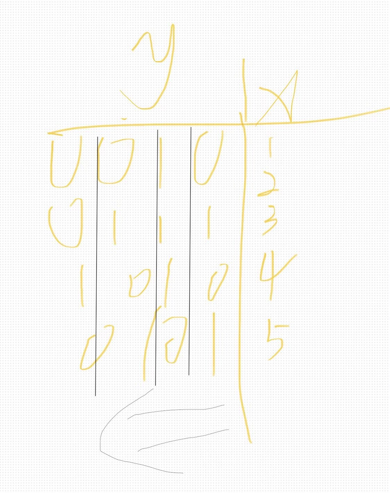

# Bitset

### purpose

多个元素在多个集合中的查重

### properties

二进制

```cpp
#include <bitset>

int main() {                                                                               
    bitset <100> b[10]; //定义十个bitset,每个bitset长度为100
    b[x][y];            //[x]表示第x个bitset，[y]表示第x个bitset的第y位

    bitset <8> b(5);    //定义一个单独得bitset， b = 00000110 (二进制)
    bitset <8> b("111111") //b = 00111111
    b[3] = 1;           // 设置第3位 = 1
    | b[7] b[6] b[5] b[4] b[3] b[2] b[1] b[0] |
    | 0   | 0  | 0  | 0  |  1 | 1  | 0  |  1  |

    bitset <8> b;
    cin >> b; //输入"111111"
    b = 00111111;
    //若输入的字符串长度 > 8， 会报错或截断

    occ[1] = 101010;
    occ[2] = 111000;
    ooc[1] & occ[2] = 101000; //按位与
    ooc[1] | occ[2] = 111010; //按位或
    ooc[1] ^ occ[2] = 010010; //对称差集

    .any() → 如果有 至少一位是 1，返回 true。
    .none() → 如果 所有位都是 0，返回 true。
    .all() → 如果 所有位都是 1，返回 true。
    occ[1] = 1010;
    occ[2] = 1100;
    occ[1] & occ[2] = 1000;
    (occ[1] & occ[2]).any() = 1;

    .count() //返还 “1” 的个数
    .flip()  //反转所有位
    ======
    cout << b; //输出二进制
    cout << b.to_ulong(); //输出十进制

}
```

