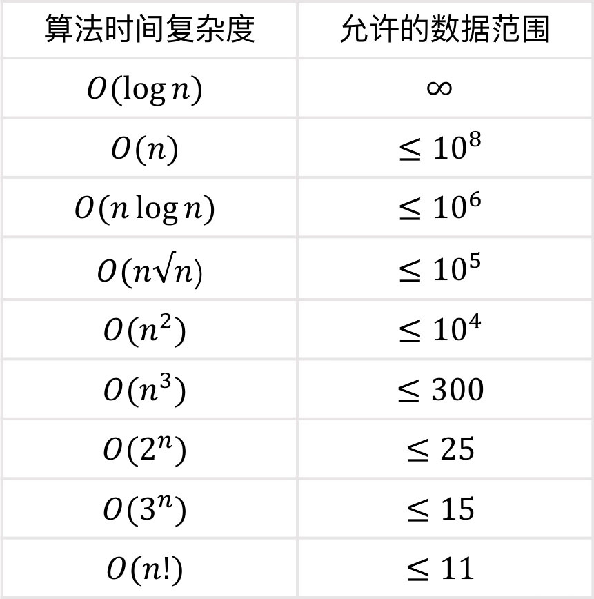

# 快速输入输出

```cpp
#include <iostream>

// 通常放在 main 函数的开头
void simple_fast_io() {
    // 1. 关闭 C++ 流与 C 标准I/O的同步
    // 这会使得 cin/cout 不再需要与 scanf/printf 保持同步，从而提高速度
    ios_base::sync_with_stdio(false);

    // 2. 解除 cin 与 cout 的绑定
    // 默认情况下，每次执行 cin 操作前，都会刷新 cout 的缓冲区。
    // 解除绑定后，cout 不再被 cin 强制刷新，减少了不必要的I/O操作。
    cin.tie(nullptr);
}
```

# 换行

✅ \n 是字符，只是换行：

```cpp
cout << "Hello\n";
```

- 只是输出一个换行符，不做其他事。

- 输出是 **写入缓冲区**，系统稍后才一起刷新到终端（提高效率）。

- 所以连续输出多个 \n 是非常快的。

⚠️ endl 是函数，会换行 + 刷新缓冲区：

```cpp
cout << "Hello" << endl;
```

等价于：

```cpp
cout << "Hello\n";
cout.flush();  // 刷新输出缓冲区
```

这会导致每次 endl 都触发一次 I/O 系统调用，**非常慢**，尤其在大数据量输出时会成为瓶颈。

# .reserve()

### 预留哈希桶

```cpp
#include <iostream>
#include <set>
#include <map>

int main() {
    int n;
    cin >> n;

    set<int> s;
    s.reserve(n);

    map<int, int> m;
    m.reserve(n);
}
```

