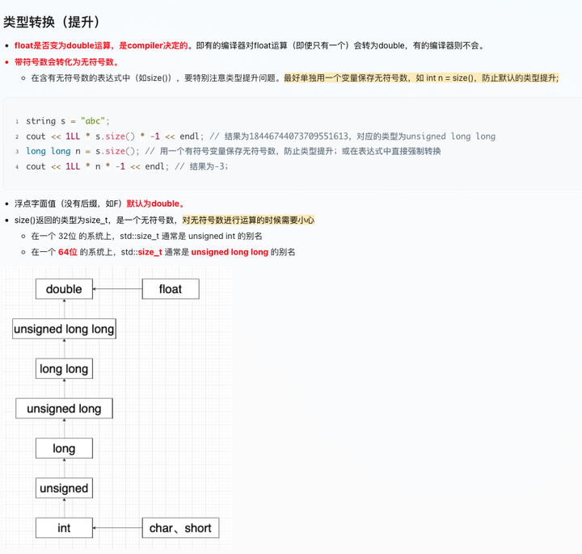

1-12 stl 刷透 8.2比赛二等奖

记int 占空间大小的推理过程，估算大小

时间复杂度是什么？

类型升级



转换类型：

```c
(int)a  
(longlong)a
long long b = s.size()
```

```c
#include <iomanip> 
setfill() setw()
```

将long long简化成ll

```c
#define ll long long       //结尾不加分号
typedef long long ll;
using ll = long long;
```

4.78828 * 10^18 = 4.78828e+18

学东西要吃透，不能写完题就好了


vscode的调试功能

codeforce参赛div3 2h完成前3题最少

atcoder参赛

计算机方向：数据结构、操作系统、计算机网络、计算机组成原理、数据库

Linux、C语言、Java